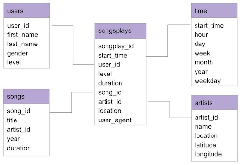

<h1>Sparkify<h1>
<h3>Udacity Data Engineering Nanodegree</h3>
˘

# Data Modeling Project

This is my solution for the *Data Modeling with Postgres* Project from the [Data Engineering Nanodegree at Udacity ](https://eu.udacity.com/course/data-engineer-nanodegree--nd027). The goal is to create a star schema optimized for queries on song play analysis.

## Getting Started

I created a Docker container to be able to run the project on my local machine. The following steps are tested only for Mac OS Catalina.

```
  https://github.com/Mavengence/Data-Modeling-PostgreSQL.git
```

### Project Structure
```
Data-Modeling-PostgreSQL
|
│   README.md               # Project description
│   docker-compose.yml      # PostgreSQL container description   
|
└───data                    # The dataset
|   |               
│   └───log_data
|   └───song_data
|
└───modeling                # Source code
|   |               
│   └───notebooks           # Jupyter notebooks
│   |   │  etl.ipynb        # ETL notebook
|   |   |  test.ipynb       # PSQL queries notebook
|   |   |
|   └───scripts
│       │  create_tables.py # Create Schema script
|       |  etl.py           # ETL script
|       |  sql_queries.py   # Definition of all sql queries
```

### Docker

To run the project, please clone this repository first, select the project folder in the terminal and execute the following command to create the docker container based on the 'docker-compose.yml' file I attached to this project.

```
docker-compose up
```

### Virtual Environment

I created a virtual environment with conda. You can create it in the following way, where *<env_name>* must be replaced with a name of your choice. At the end the environment can be removed.

```
conda create --name <env_name> --file requirements.txt

conda remove --name <env_name>
```

### Run the ETL Process

To create and populate the database, execute the following commands:

```
conda activate <env_name>                    # Activate the conda environment
python modeling/scripts/create_tables.py     # Create database and empty tables
python modeling/scripts/etl.py               # Populate tables
```

The evaluation file is stored in after starting the jupyter notebook:
```
jupyter notebook
move to: modeling/notebooks/test.ipynb       # Test the table entries         
```

## Data Warehousing at Sparkify

A startup called Sparkify wants to analyze the data they've been collecting on songs and user activity on their new music streaming app. The analytics team is particularly interested in understanding what songs users are listening to. Currently, they don't have an easy way to query their data, which resides in a directory of JSON logs on user activity on the app, as well as a directory with JSON metadata on the songs in their app.

## Database Schema

The database is a Star Schema with one fact table (songplays) and four dimension tables (time, users, songs and artists).




## Author

* **Tim Löhr** - [Mavengence](https://github.com/mavengence)

## License

This project is licensed under the MIT License
